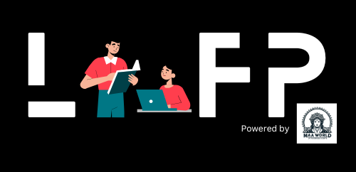

  
<h1>Maa World Foundation</h1>

Learn Together, Grow Together | Spread your knowledge around the world 🤗

## Our Vision: Education for Everyone & Everywhere 🌍
At Maa World Foundation, we believe education is the key to unlocking dreams and changing lives. By 2026, we aim to provide free, high-quality education to over 500 million students worldwide.

Our mission is simple yet powerful: education for everyone, everywhere. It doesn’t matter where you come from, how old you are, or what challenges you face -- if you have the will to learn, we are here for you.

Join us in building a brighter tomorrow. Let’s make education a gift that every heart and mind can embrace. Together, we can change lives.

## Learn & Contribute ✨
Here are some useful resources to help you get started: 

- <a href="https://github.com/MaaWorld/ComputerScience">Learn Computer Science 🧑‍💻<->👩‍💻 | A2Z Free Course</a> (Ongoing...🤗)  
- <a href="https://github.com/MaaWorld/DataStructure-Algorithms">Learn Data Structure & Algorithm's (DSA) 🧑‍💻<->👩‍💻 | A2Z Free Course</a> (Ongoing...🤗)  
- <a href="https://github.com/MaaWorld/Mathematics">Learn Complete Mathematics 🧑‍💻<->👩‍💻 | A2Z Free Course</a>

Feel free to explore these resources to enhance your learning experience! 

>
> ## NOTE: 
> <strong>We are always looking for contributors to help us improve our resources. If you are interested in contributing, please join <a href="https://github.com/orgs/MaaWorld/discussions">discussions</a>, give your <a href="https://github.com/orgs/MaaWorld/discussions/1">introduction</a> and share your <a href="https://github.com/orgs/MaaWorld/discussions/2">ideas</a> with us. We would love to hear from you! 🤗</strong>
>
---

`If you have any questions or need help, please don't hesitate to reach out. We are here to support you every step of the way. 🤗`

## Our Communities 🌐

    
    
    
    

## Our Team 🚀
Prince Chhirolya (Founder & CEO - Chhirolya Technologies & Maa World Foundation)
- Email: [chhirolyaprince@gmail.com](mailto:chhirolyaprince@gmail.com)
- LinkedIn: [Prince Chhirolya](https://www.linkedin.com/in/prince-chhirolya/)
- Twitter: [Prince Chhirolya](https://twitter.com/pr_chhirolya)

> Our team is growing, and we are always looking for new members to join us on this incredible journey. If you are interested in contributing, please reach out to us. We would love to have you on board!

 

  

<!-- Don't Update any one -->
